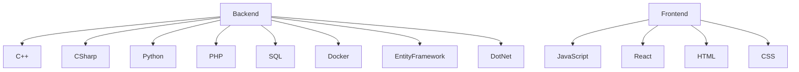

# 👨‍💻 Desarrollador Backend & Full Stack

## 🛠️ Especialista en Backend

Desarrollador con sólida experiencia en arquitecturas de backend, diseño de APIs y bases de datos. Apasionado por crear sistemas escalables, eficientes y de alto rendimiento.

---

### 💻 Stack Tecnológico

  
  
  
  
  
  
  
  
  
  
  

---

### 📊 Estadísticas de GitHub

  
  

---

### 🏆 Proyectos Destacados

#### 🌟 [La Serranita]([enlace](https://miportafoliopedro.atwebpages.com/proyecto-serranita.html))
Página Web para cafetería de la universidad con funciones de backend.

**Tecnologías:** HTML, JS, CSS, PHP, Bootstrap, SQL

#### 🌟 [Página web con Python](https://miportafoliopedro.atwebpages.com/proyecto-python.html)
Aprendí a manejar JSON, implementación de APIs, descarga y generación de formatos PDF.

**Tecnologías:** HTML, JS, CSS, Python, APIs, SCSS, PDF

#### 🌟 [Identificador de Personas](https://miportafoliopedro.atwebpages.com/proyecto-identificador.html)
Cree una app que puede identificar rostros en base a una imagen y dar acceso o hacer alguna otra opción.

**Tecnologías:** Python, Face Recognition, Cv2

#### 🌟 [Identificador de Colores](https://miportafoliopedro.atwebpages.com/proyecto-colores.html)
Cree una app que puede identificar colores en el centro y reconocer el color y ángulo.

**Tecnologías:** Python, Face Recognition, numpy

#### 🌟 [Eccommerce Clon De Amazon (En curso)](https://miportafoliopedro.atwebpages.com/portafolio.html)
Clon de Amazon desde 0 usando Entity Framework y CleanArchitecture.

**Tecnologías:** C#, Entity Framework, Docker, APIs

#### 🌟 [Capacitación Virtual (en curso)](https://miportafoliopedro.atwebpages.com/portafolio.html)
Videojuego a través de realidad virtual en donde se capacita al personal operador.

**Tecnologías:** C#, Unity

---

### 🧠 Áreas de especialización

- Arquitectura de microservicios
- Optimización de rendimiento backend
- Diseño y gestión de bases de datos
- APIs RESTful y GraphQL
- Implementación de patrones de diseño
- Integración continua / Despliegue continuo (CI/CD)
- Containerización y orquestación

---

  <i>💼 Abierto a oportunidades profesionales de desarrollo backend</i>

