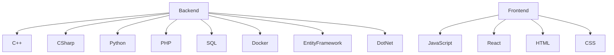

# 👨‍💻 Desarrollador Backend & Full Stack

## 🛠️ Especialista en Backend

Desarrollador con sólida experiencia en arquitecturas de backend, diseño de APIs y bases de datos. Apasionado por crear sistemas escalables, eficientes y de alto rendimiento.

---

### 💻 Stack Tecnológico

  
  
  
  
  
  
  
  
  
  
  

---

### 📊 Estadísticas de GitHub

  
  

---

### 🏆 Proyectos Destacados

#### 🌟 [Nombre del Proyecto](enlace)
Sistema backend desarrollado en C# y .NET Core que gestiona [descripción]. Implementa arquitectura de microservicios y contenedores Docker.

**Tecnologías:** C#, .NET, SQL Server, Entity Framework, Docker

#### 🌟 [Nombre del Proyecto](enlace)
API REST completa para [descripción del propósito] desarrollada con C++ y SQLite. Incluye autenticación, autorización y documentación completa.

**Tecnologías:** C++, SQLite, REST API, JWT

#### 🌟 [Nombre del Proyecto](enlace)
Plataforma fullstack para [descripción] que utiliza React en el frontend y Python (FastAPI) en el backend.

**Tecnologías:** Python, FastAPI, React, PostgreSQL

---

### 🧠 Áreas de especialización

- Arquitectura de microservicios
- Optimización de rendimiento backend
- Diseño y gestión de bases de datos
- APIs RESTful y GraphQL
- Implementación de patrones de diseño
- Integración continua / Despliegue continuo (CI/CD)
- Containerización y orquestación

---

### 📈 Contribuciones

---

  <i>💼 Abierto a oportunidades profesionales de desarrollo backend</i>

